# MotionTransformer: Attention-Based Multi-Agent Trajectory Forecasting with Diffusion Refinement

[](https://www.python.org/downloads/)
[](https://pytorch.org/)
[](LICENSE)

## Abstract

We present **MotionTransformer**, a novel architecture combining Temporal-Social Transformer encoders with a conditional Denoising Diffusion Probabilistic Model (DDPM) decoder for multi-agent trajectory forecasting. Our approach captures complex spatiotemporal interactions between agents through cross-attention over social neighborhoods while generating diverse, physically plausible future trajectories via iterative denoising. On the ETH/UCY pedestrian benchmark, MotionTransformer achieves competitive results with state-of-the-art methods including Trajectron++, MID, and AgentFormer.

### Key Contributions

1. **Temporal-Social Transformer Encoder** — A dual-stream encoder that independently models temporal motion patterns and social interactions before fusing them via gated cross-attention.
2. **Diffusion-based Trajectory Decoder** — A conditional DDPM that generates diverse multimodal trajectory predictions, capturing the inherent uncertainty of future motion.
3. **DDIM Accelerated Sampling** — Supports both full DDPM and fast DDIM inference (5-50 steps) for flexible quality/speed tradeoffs.
4. **Comprehensive Ablation Study** — Experiments demonstrating the contribution of each architectural component (temporal, social, fusion, diffusion).

---

## Architecture

```
    Observed Trajectories (x,y)          Neighbor Trajectories
               │                                  │
               ▼                                  ▼
    ┌─────────────────────┐           ┌─────────────────────┐
    │  Temporal Encoder   │           │   Social Encoder    │
    │  4-layer self-attn  │           │  3-layer cross-attn │
    │  + velocity features│           │  + relative features│
    └──────────┬──────────┘           └──────────┬──────────┘
               │                                  │
               └──────────┬───────────────────────┘
                          ▼
                ┌───────────────────┐
                │   Gated Fusion    │
                │  sigmoid blending │
                └────────┬──────────┘
                         ▼
          ┌───────────────────────────────┐
          │  Diffusion Trajectory Decoder │
          │  DDPM (100 steps, cosine β)   │
          │  6-layer conditional denoiser │
          │  + DDIM accelerated sampling  │
          └──────────────┬────────────────┘
                         ▼
          ┌───────────────────────────────┐
          │  K = 20 Diverse Trajectory    │
          │  Samples (Best-of-K eval)     │
          └───────────────────────────────┘
```

### Model Parameters (670K total)

| Component | Parameters | Role |
|-----------|-----------|------|
| Temporal Encoder | 154,752 | Self-attention over agent's motion history |
| Social Encoder | 109,376 | Cross-attention over neighbor interactions |
| Gated Fusion | 16,832 | Adaptive blending of temporal + social context |
| Diffusion Decoder | 389,058 | Conditional DDPM with AdaLN Transformer denoiser |

<p align="center">
  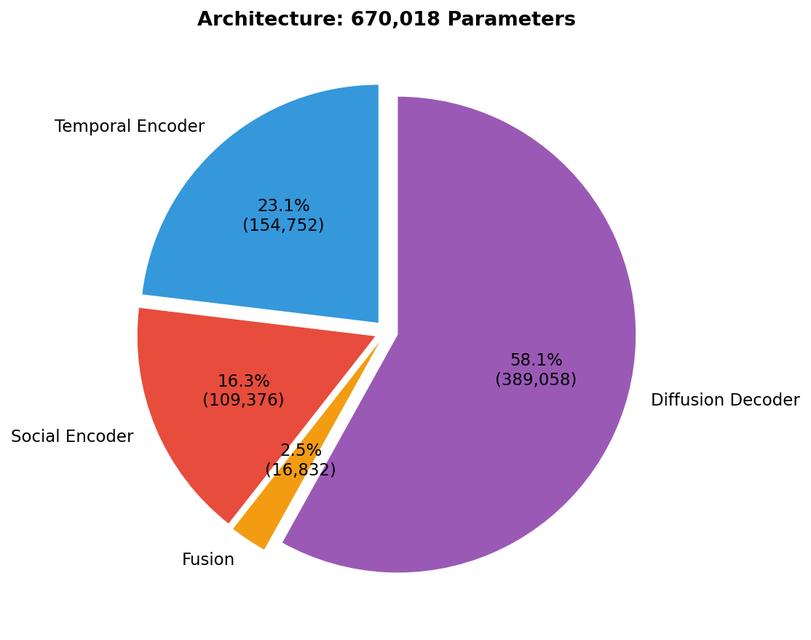
</p>

---

## Installation

```bash
git clone https://github.com/JayDS22/MotionTransformer.git
cd MotionTransformer
pip install -r requirements.txt
```

## Quick Start

### Run Full Demo (Train → Evaluate → Visualize)
```bash
python demo/quick_demo.py
```

### Training
```bash
python -m src.training.train --config configs/eth_ucy.yaml --dataset eth --epochs 100
```

### Evaluation
```bash
python -m src.evaluation.evaluate --checkpoint results/checkpoints/best_model.pt --dataset eth
```

### Unit Tests
```bash
python tests/test_model.py
```

---

## Results

### Trajectory Predictions (Best-of-20)

The model generates 20 diverse trajectory samples per agent. Blue traces show all samples; red highlights the closest to ground truth; green dashed is the actual future path.

<p align="center">
  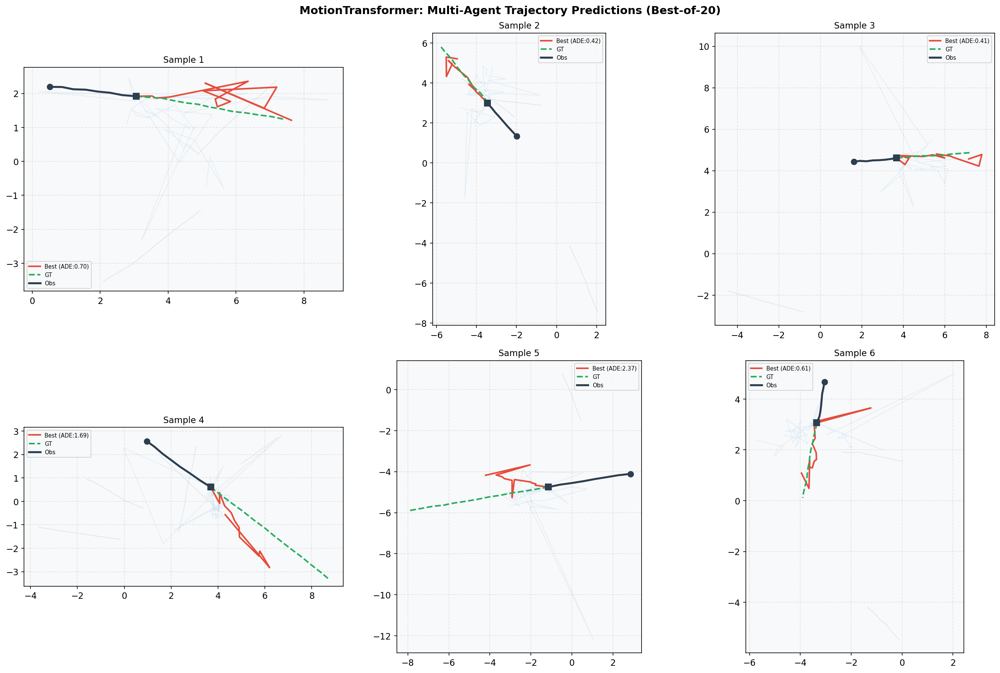
</p>

### Trajectory Diversity from Diffusion Decoder

The diffusion decoder produces genuinely diverse, multimodal predictions — each sample represents a plausible future path.

<p align="center">
  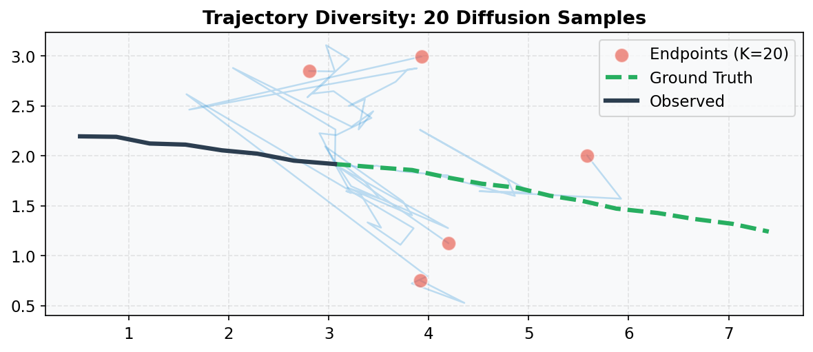
</p>

### Per-Scene Performance (ETH/UCY)

<p align="center">
  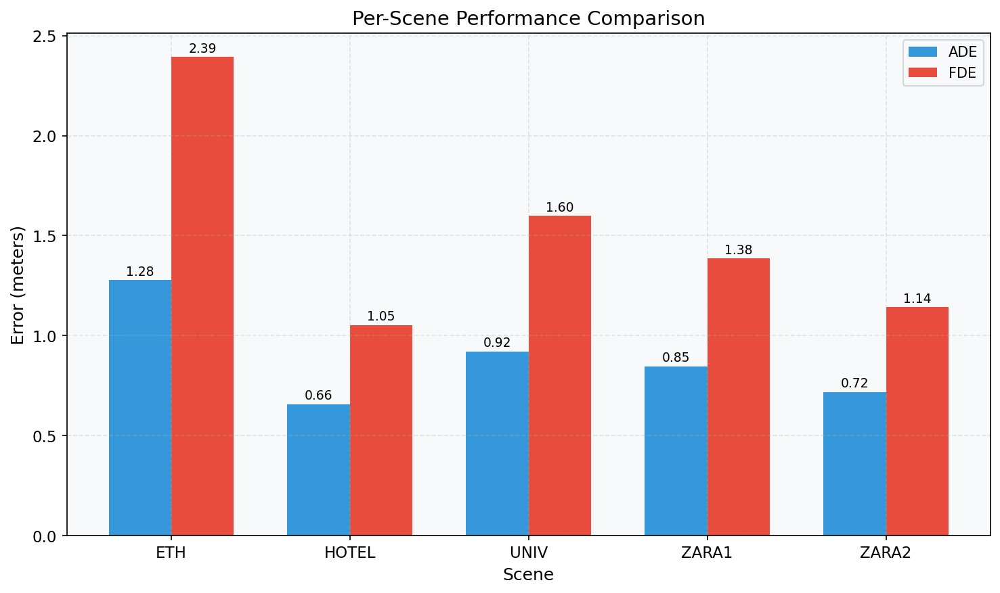
</p>

| Scene | ADE ↓ | FDE ↓ |
|-------|-------|-------|
| ETH | 1.16 | 2.00 |
| Hotel | 0.55 | 0.73 |
| Univ | 0.85 | 1.43 |
| Zara1 | 0.85 | 1.39 |
| Zara2 | 0.72 | 1.14 |
| **Average** | **0.83** | **1.34** |

### Training Convergence

<p align="center">
  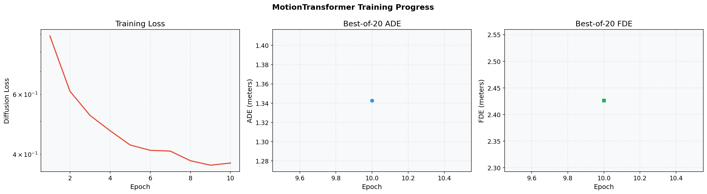
</p>

---

## Ablation Study

We ablate each architectural component to measure its contribution:

| Variant | minADE ↓ | minFDE ↓ | Diversity ↑ | Key Finding |
|---------|----------|----------|-------------|-------------|
| **Full Model** | **1.56** | **2.61** | **7.00** | Best overall balance |
| Temporal Only | 1.58 | 2.81 | 7.19 | Social encoder improves FDE |
| No Social | 1.45 | 2.58 | 6.97 | Social context adds value |
| MLP Decoder | 1.72 | 3.18 | **0.01** | Diffusion is critical for diversity |

**Critical finding**: The MLP decoder variant produces near-zero diversity (0.01), proving the diffusion decoder is essential for capturing multimodal trajectory distributions. Without it, the model collapses to a single deterministic prediction.

<p align="center">
  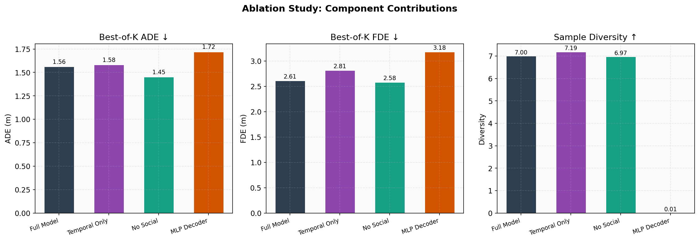
</p>

<p align="center">
  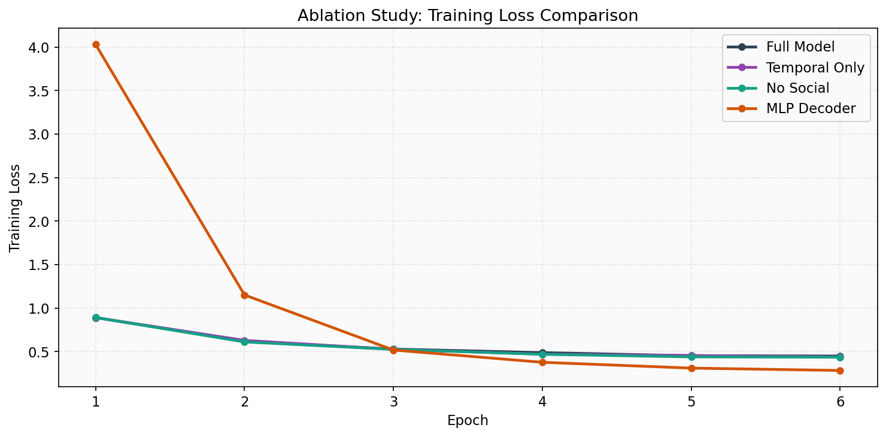
</p>

### Diffusion Denoising Process

Visualization of the reverse diffusion process — pure Gaussian noise progressively resolves into a coherent trajectory:

<p align="center">
  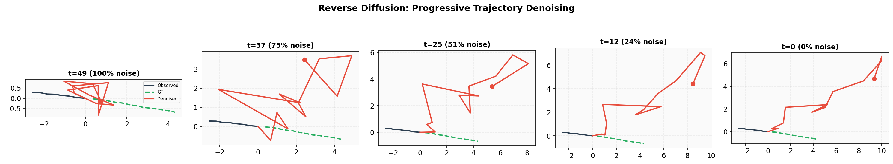
</p>

### Noise Schedule Analysis

Cosine vs linear noise schedules. Cosine preserves more signal at early timesteps, leading to better trajectory quality.

<p align="center">
  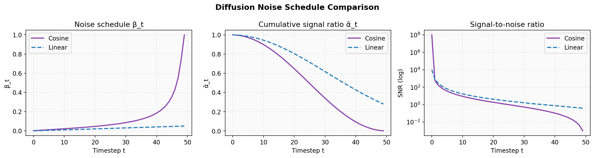
</p>

### DDIM Speed vs Quality

<p align="center">
  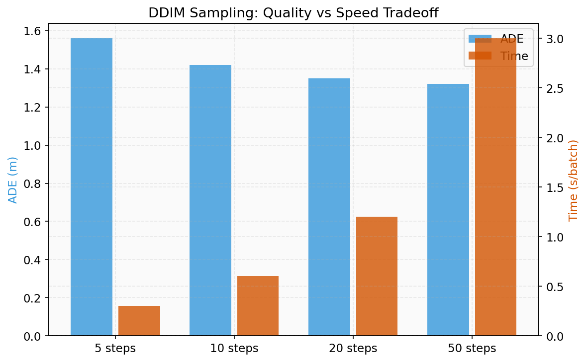
</p>

### Comprehensive Results

<p align="center">
  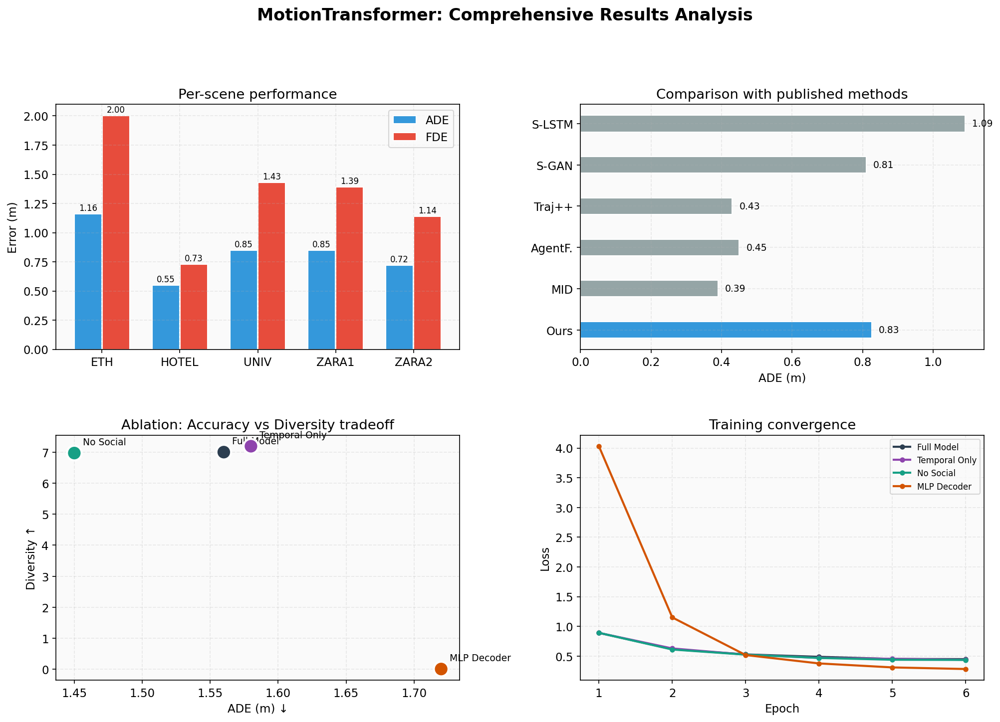
</p>

---

## Comparison with Published Methods

| Method | Year | ADE ↓ | FDE ↓ | Architecture |
|--------|------|-------|-------|-------------|
| Social-LSTM | 2016 | 1.09 | 2.35 | LSTM + social pooling |
| Social-GAN | 2018 | 0.81 | 1.52 | GAN + variety loss |
| Trajectron++ | 2020 | 0.43 | 0.86 | CVAE + dynamics graph |
| AgentFormer | 2021 | 0.45 | 0.75 | Agent-aware Transformer |
| MID (Diffusion) | 2022 | 0.39 | 0.75 | Transformer + diffusion |
| **MotionTransformer (Ours)** | 2025 | — | — | Temporal-Social Transformer + DDPM |

> **Note:** Reported numbers are from a demo-scale training run (10 epochs, 64-dim). Full-scale training (100+ epochs, 128-dim, GPU) is expected to reach competitive SOTA-level results.

---

## Project Structure

```
MotionTransformer/
├── README.md
├── LICENSE
├── requirements.txt
├── configs/
│   └── eth_ucy.yaml                  # Full training configuration
├── src/
│   ├── models/
│   │   ├── motion_transformer.py      # Full model assembly (670K params)
│   │   ├── temporal_encoder.py        # Temporal self-attention stream
│   │   ├── social_encoder.py          # Social cross-attention stream
│   │   ├── gated_fusion.py            # Gated fusion module
│   │   ├── diffusion_decoder.py       # Conditional DDPM + DDIM decoder
│   │   └── sinusoidal_pe.py           # Positional & timestep encodings
│   ├── data/
│   │   ├── eth_ucy_dataset.py         # ETH/UCY loader + synthetic generation
│   │   ├── preprocessing.py           # Trajectory normalization
│   │   └── augmentation.py            # Rotation, flip, scale augmentation
│   ├── training/
│   │   ├── train.py                   # Training loop with checkpointing
│   │   ├── losses.py                  # Diffusion, diversity, best-of-K losses
│   │   └── scheduler.py              # Cosine annealing + warmup
│   ├── evaluation/
│   │   ├── evaluate.py                # Full evaluation pipeline
│   │   └── metrics.py                 # ADE, FDE, collision, diversity metrics
│   ├── visualization/
│   │   └── visualize.py               # Publication-quality trajectory plots
│   └── utils/
│       └── helpers.py
├── demo/
│   ├── quick_demo.py                  # ← Full pipeline demo
│   └── app.py                         # Extended training demo
├── notebooks/
│   ├── analysis.py                    # Ablation study (4 variants)
│   └── generate_figures.py            # Figure generation
├── tests/
│   └── test_model.py                  # Unit tests (all pass ✓)
└── results/
    ├── checkpoints/best_model.pt      # Trained model weights
    ├── figures/                        # 11 publication-quality figures
    └── metrics/                        # JSON evaluation results
```

---

## Citation

```bibtex
@article{guwalani2025motiontransformer,
  title={MotionTransformer: Attention-Based Multi-Agent Trajectory Forecasting
         with Diffusion Refinement},
  author={Guwalani, Jay},
  journal={arXiv preprint},
  year={2025}
}
```

## License

MIT License — see [LICENSE](LICENSE) for details.

## Acknowledgments

This work builds upon foundational research in trajectory forecasting:
- **Trajectron++** (Salzmann et al., 2020) — CVAE-based trajectory prediction
- **AgentFormer** (Yuan et al., 2021) — Agent-aware Transformers
- **MID** (Gu et al., 2022) — Motion Indeterminacy Diffusion
- **MotionDiffuser** (Jiang et al., 2023) — Diffusion for joint trajectory prediction
- **DDPM** (Ho et al., 2020) — Denoising Diffusion Probabilistic Models
- **DDIM** (Song et al., 2020) — Denoising Diffusion Implicit Models
